## part 3
Напишем мини сервер на C и FastCgi, который будет возвращать простейшую страничку с надписью Hello World!
Файл для создания мини сервера server.c:
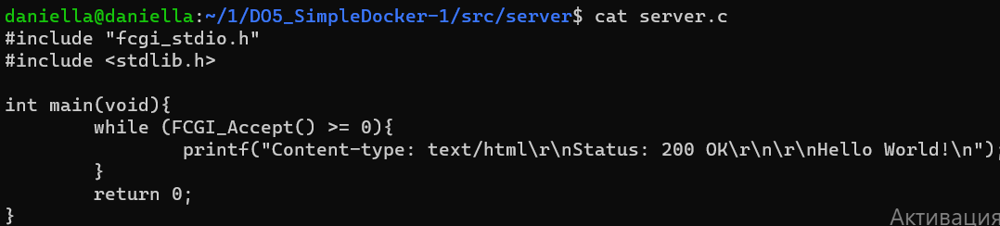

 Напишем свой nginx/nginx.conf, который будет проксировать все запросы с 81 порта на 127.0.0.1:8080

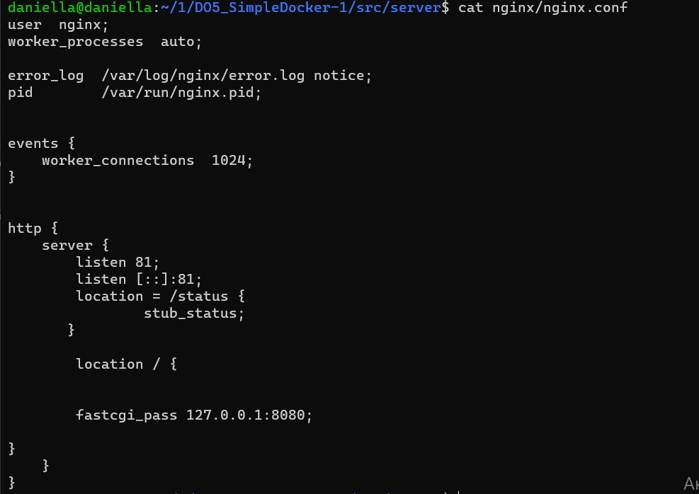

Запустим написанный мини сервер через spawn-fcgi на порту 8080
Для этого в начале запустим докер с замапленным портом 81 командой `docker run -d -p 81:81  288ae219f169`
 
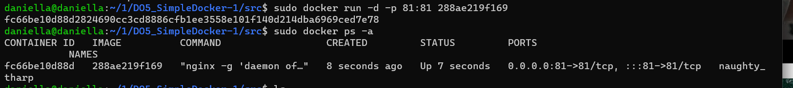

Скопируем созданные файлы в докер с помощью `nginx.conf fc66be10d88d:/etc/nginx/` и `docker cp docker/server/server.c fc66be10d88d:/home/`

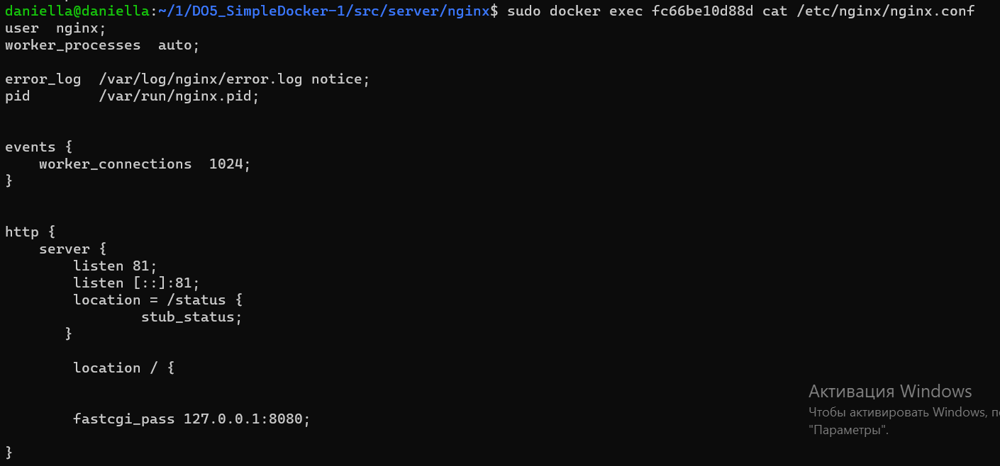

Войдем в контейнер с помощью docker exec -it container_id bash (exit - выход из докера). Теперь установим нужные пакеты (gcc, spawn-fcgi, libfcgi-dev) командой apt install gcc spawn-fcgi libfcgi-dev (Перед этим выполним обновление через apt-get update)

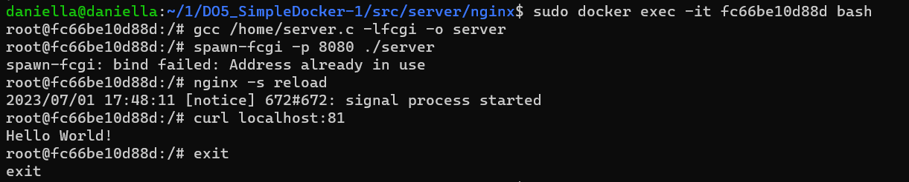

## part 4
 Соберем свой свой докер.
Для этого создадим Dockerfile и start.sh

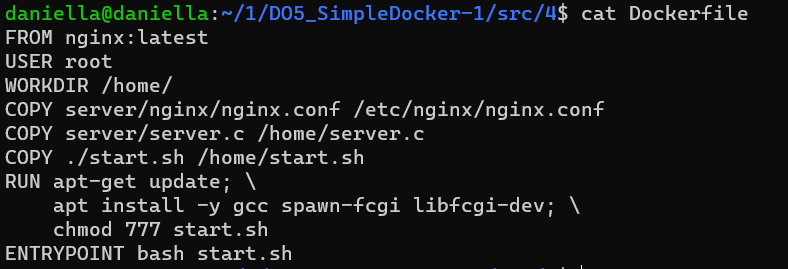
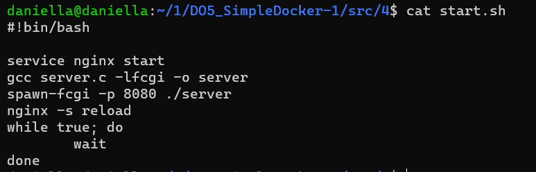

Соберем написанный докер образ командой `docker build -t test:a1 .`
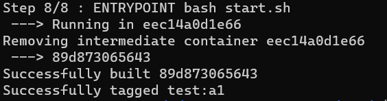

Проверим через docker images, что все собралось корректно

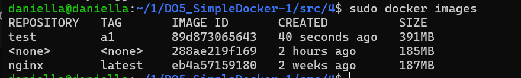

Запустим собранный докер образ с маппингом 81 порта на 80 на локальной машине и маппингом папки ./nginx внутрь контейнера по адресу, где лежат конфигурационные файлы nginx'а
Для этого воспользуемся командой docker `sudo docker run -p 80:81 -v /home/daniella/1/DO5_SimpleDocker-1/src/4/server/nginx
/nginx.conf:/etc/nginx/nginx.conf -d test:a1`
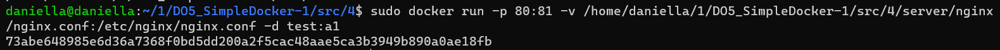

 Проверим, что по localhost:80 доступна страничка написанного мини сервера командой curl localhost:80

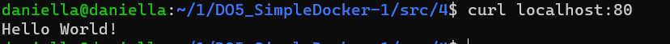

Проверим, что теперь по localhost:80/status отдается страничка со статусом nginx командой curl localhost:80/status

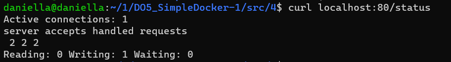

## part 5

Установим Dockle в соотвествии с инструкцией https://habr.com/ru/company/timeweb/blog/561378/
Dockle — инструмент для проверки безопасности образов контейнеров, который можно использовать для поиска уязвимостей.

Просканируем образ из предыдущего задания через `dockle [image_id|repository]`
В нашем случае `dockle test:a1`

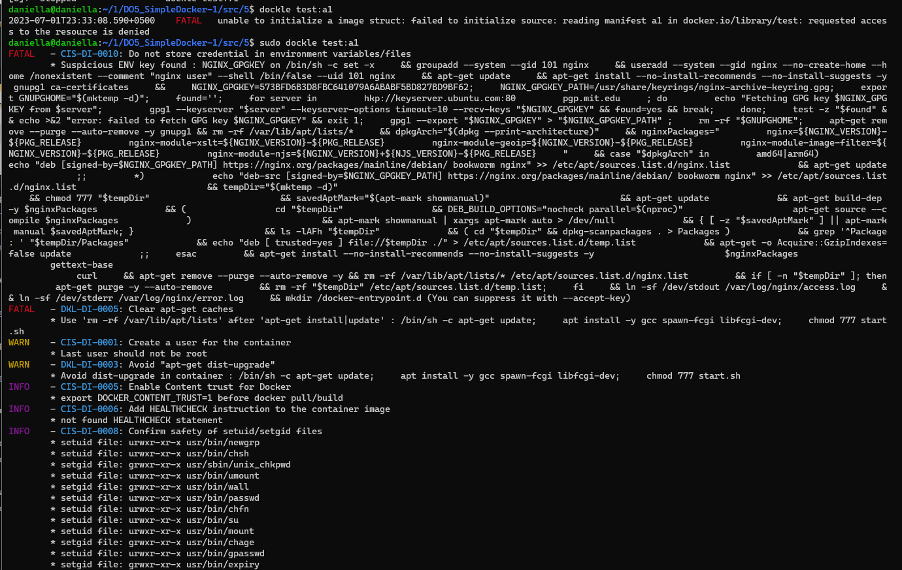

 Исправим образ так, чтобы при проверке через dockle не было ошибок и предупреждений
Для этого вначале удалим образ, исправим наш Dockerfile, а затем заново собираем образ(как в части 4) и снова сканируем образ

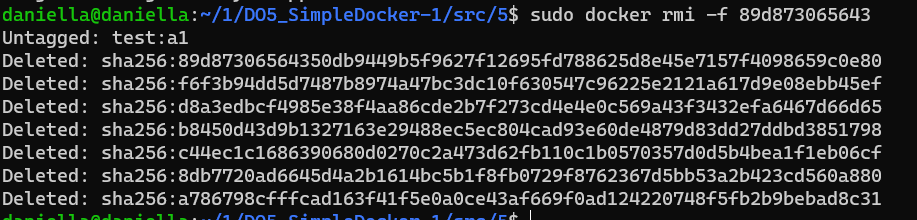
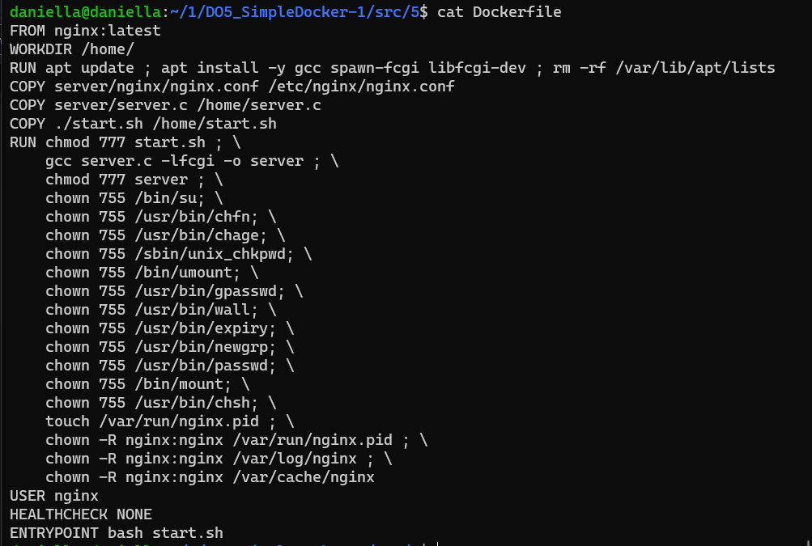

Заново собираем образ `docker build -t test:a1 .`
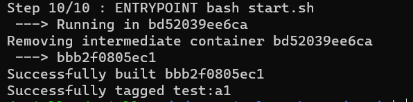

Исправить образ так, чтобы при проверке через dockle не было ошибок и предупреждений.  `sudo dockle -i CIS-DI-0010 test:
a1`
